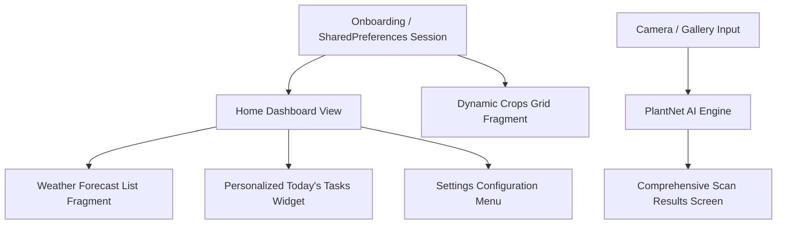

# Farm-able 🌾

[](https://github.com/your-username/Farmable/actions)
[](https://kotlinlang.org)
[](https://developer.android.com)
[](https://opensource.org/licenses/MIT)

Farm-able is an enterprise-grade, mobile-first agricultural intelligence solution designed to empower smallholder farmers. By blending smart local task automation, localized real-time weather analytics, customized crop profile trackers, and remote AI-powered plant pathology scanning, Farm-able transforms raw farm inputs into data-driven yield optimizations.

---

## 📋 Comprehensive Project Report

### 1. Core Purpose of the Application
Small-scale agriculture is highly vulnerable to unpredictability, ranging from fluctuating microclimates to sudden pest infestations and disease spreads. The fundamental purpose of **Farm-able** is to eliminate information asymmetry for smallholder farmers by providing a unified, context-aware digital assistant on the field.

*   **Actionable Workflow Guidance**: Translating generic agricultural guidelines into dynamic, daily on-farm checklists personalized to the growth stage of specific crops.
*   **Preventative Risk Management**: Merging real-time OpenWeatherMap API telemetry directly into daily field schedules to warn farmers about imminent frost, low precipitation, or excessive rainfall risks.
*   **Democratized Disease Diagnosis**: Leveraging state-of-the-art computer vision models via the PlantNet API to provide instant, high-accuracy disease identification without requiring expensive agronomist consultations.

---

### 2. Design Considerations & Architecture Principles
To deliver a robust experience in rural and outdoor settings, the application implements the following core architectural and UX design principles:



#### 📱 Mobile-First & High-Contrast UX
*   **Outdoor Legibility**: Styled with high-contrast text layers and prominent Google Material 3 card groupings to ensure clear visibility under direct sunlight during field operations.
*   **Intentional Friction Reduction**: Simplified multi-step onboarding processes directly translate user configurations (farm size, crop preferences, and location) into tailored layouts instantaneously.

#### 🏗️ Architecture & Session Modularity
*   **Loose Coupling via Fragments**: The view architecture isolates logic components into single-responsibility fragments (`TaskFragment`, `CropFragment`, `WeatherFragment`, `PlantScanFragment`, `SettingsFragment`, and `ScanResultFragment`), swap-managed dynamically by the host lifecycle container.
*   **Single Source of Truth (SSOT)**: Local device configurations and user preferences are handled via a robust central `SharedPreferences` session wrapper, ensuring consistency across disparate features (e.g., matching the Weather API query string exactly to the city entered during onboarding).
*   **Dynamic and Resilient Layout Flow Layers**: View components (such as scroll view layouts and custom adapters) use dynamic wrap-dimensions (`wrap_content`) and viewport parameters (`fillViewport="true"`) to prevent content overlap or clipping on varyingly sized hardware screens.

---

### 3. Utilisation of GitHub & Branching Strategy
The project leverages **GitHub** as its foundational Version Control System (VCS) and collaborative hub to maintain high codebase stability and historical auditability.

*   **Feature Branching Workflow**: Direct pushes to the `main` branch are strictly prohibited. Developers implement updates inside isolated `feature/` or `bugfix/` branches, which are merged back only via peer-reviewed **Pull Requests (PRs)**.
*   **Semantic Commit Messages**: Commit histories enforce clear tags (e.g., `feat: implement task filtering options`, `fix: resolve weather layout overlay collision`) to streamline tracking and automated release note generations.
*   **Issue and Progress Boards**: GitHub Issues are actively paired with milestone trackers to map planned feature increments cleanly against upcoming deployment lifecycles.

---

### 4. Continuous Integration via GitHub Actions (CI/CD)
To guarantee that every modification maintains build stability and satisfies premium code health indices, Farm-able integrates an automated **GitHub Actions CI Pipeline**. 

Every Pull Request or push event targeted at primary branches triggers the `.github/workflows/android.yml` automation pipeline:

```yaml
name: Android CI/CD Pipeline

on:
  push:
    branches: [ main, develop ]
  pull_request:
    branches: [ main ]

jobs:
  build:
    name: Compile & Validate Build
    runs-on: ubuntu-latest

    steps:
    - name: Checkout Repository Source
      uses: actions/checkout@v3

    - name: Configure Java Development Kit (JDK 17)
      uses: actions/setup-java@v3
      with:
        distribution: 'zulu'
        java-version: '17'
        cache: 'gradle'

    - name: Validate Gradle Dependency Wrappers
      uses: gradle/wrapper-validation-action@v1

    - name: Run Static Code Analysis & Linting Checks
      run: ./gradlew lintDebug

    - name: Assemble Debug Application Binary (APK)
      run: ./gradlew assembleDebug

    - name: Archive Compiled Application Build Artifacts
      uses: actions/upload-artifact@v3
      with:
        name: farmable-debug-apk
        path: app/build/outputs/apk/debug/app-debug.apk
```

#### Key Capabilities of the Build Automation:
1.  **Automated Dependency Caching**: Speeds up build executions by securely storing and re-utilizing Gradle build caches across pipeline instances.
2.  **Linting & Static Quality Gates**: Automatically executes Android Lint check rules to capture code anomalies, hardcoded layout components, or structural bottlenecks early before runtime deployments.
3.  **Artifact Generation**: Successfully builds a drop-in testing binary file (`app-debug.apk`) on every successful check, making it immediately available for manual field-testing teams.

---

## 🚀 Existing Feature Breakdown

### 1. 📅 Task Management & Dashboard Widget
*   View your **Today's Farm Tasks** via a green translucent overlay panel on the main page or access the comprehensive full screen view.
*   Clear filtering sections split into separate **Pending** and **Completed** item rows.
*   Displays critical indicators like task urgency tags (`HIGH`, `MEDIUM`, `LOW`), timelines, and actionable reasoning blocks ("Why?").
*   Instantly update status configurations in-memory using responsive **Complete** or **Skip** button controls.

### 2. 🥬 Filtered Crop Profile Trackers
*   Displays **only** the crops explicitly checked by the user during their onboarding sequence (Tomato, Pepper, Spinach, Cabbage).
*   Monitors growth parameters (e.g., `Fruit Development`, `Vegetative Growth`) alongside dynamic color-coded crop health scores (Green $\ge$ 80%, Orange $\ge$ 60%, Red otherwise).

### 3. ☀️ Localized Weather Feeds & Forecasts
*   Extracts registered location tokens to dynamically request weather analytics for the farmer's specific region.
*   Displays real-time ambient temperatures, conditions, and wind parameters, alongside a sequential **3-Hour Interval Weather Forecast list** positioned clearly under the primary summary metrics cards.

### 4. 📸 AI Plant Scan Diagnosis Reporting
*   Upload photos or capture live leaf and fruit symptoms via the device camera.
*   Connects directly to the **PlantNet API** to evaluate potential pathologies.
*   Renders detailed results on a dedicated **Scan Results Page** including disease name, confidence score percentage metrics, hazard categories, and immediate agricultural care strategies.

### 5. ⚙️ Smart Custom Settings Menu
*   Accessible by tapping the green logo icon located on the top-right header of your home dashboard.
*   Enables users to customize notification preferences, select system languages, or verify app builds.

---

## 🔧 Installation & Setup

1.  Clone the repository onto your workspace environment.
2.  Launch **Android Studio** and choose **Open Project**, selecting the cloned root folder.
3.  Allow the Gradle build system to download and synchronize project dependencies.
4.  Launch an active Android Virtual Device (AVD Emulator) or plug in a physical device.
5.  Click the **Run App** icon (`app`) to build, test, and deploy!

## link
https://youtube.com/shorts/ZgwAaGqVu_E?feature=share
